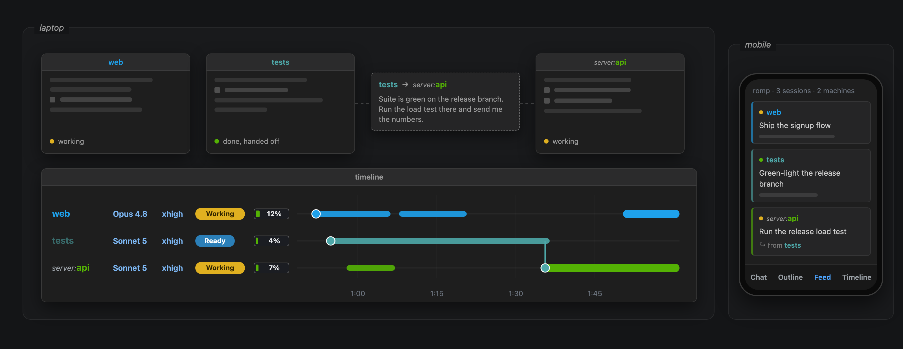

# { .romp-wordmark }

Agents like Claude Code can work autonomously for long stretches, allowing
several to be run in parallel. But this parallelism creates new management work:
tracking what the agents are doing, scrolling through transcripts to find the
background a decision needs, and coordinating handoffs of work and context.

Romp simplifies and automates this management: it tracks every agent and its
tasks, surfaces what needs your attention, and keeps them moving and working
together. *You* stay focused on what you're trying to accomplish.

Romp is built on top of Claude Code: the agents Romp manages are ordinary
sessions, gathered into one live interface.

You have full control over where Romp runs and how you access it. Its user
interface opens in a browser, in the VS Code / Cursor extension, or on
[a phone](guide.md#from-your-phone). The back end that drives the agents runs on your
laptop, on a server, or on [several machines at once](guide.md#linking-kernels-on-other-machines):
agents on different machines message each other, and you steer them all from one
place.

Its key features:

<!-- Feature sections. Real captures live in docs/assets/; the README points at the same files.
     The docs home embeds the MP4 in a <video> for the last feature; the README embeds the GIF. -->

## Every session, one view { .feature-h }

The timeline shows every session: what's running, what's idle, and what needs you.

<video src="assets/guide/every-session-timeline.mp4" controls loop muted playsinline preload="none" data-romp-autoplay width="100%"></video>

## Task management { .feature-h }

Romp reads the agents' transcripts and tracks the work, so you don't have to.

<video src="assets/guide/task-cards.mp4" controls loop muted playsinline preload="none" data-romp-autoplay width="100%"></video>

A card shows each task with the essential information: why the work is
happening, what the agent did, and the sub-tasks completed along the way.

<video src="assets/guide/context-tabs.mp4" controls loop muted playsinline preload="none" data-romp-autoplay class="romp-card-demo"></video>

## Coordination you can see { .feature-h }

The Romp Postal Service lets agents ask each other questions and hand off work.

<video src="assets/guide/coordination.mp4" controls loop muted playsinline preload="none" data-romp-autoplay width="100%"></video>

## Navigate anywhere, detail on demand { .feature-h }

Find any work by when it happened on the timeline or by the task it belonged
to, then open it for the full detail.

<video src="assets/guide/navigate.mp4" controls loop muted playsinline preload="none" data-romp-autoplay width="100%"></video>

## Every machine, one place { .feature-h }

Sessions on your server appear alongside your laptop's, agents hand off work
across [machines](guide.md#linking-kernels-on-other-machines), and you can view
everything from a laptop or [a phone](guide.md#from-your-phone).

{ width="100%" }
